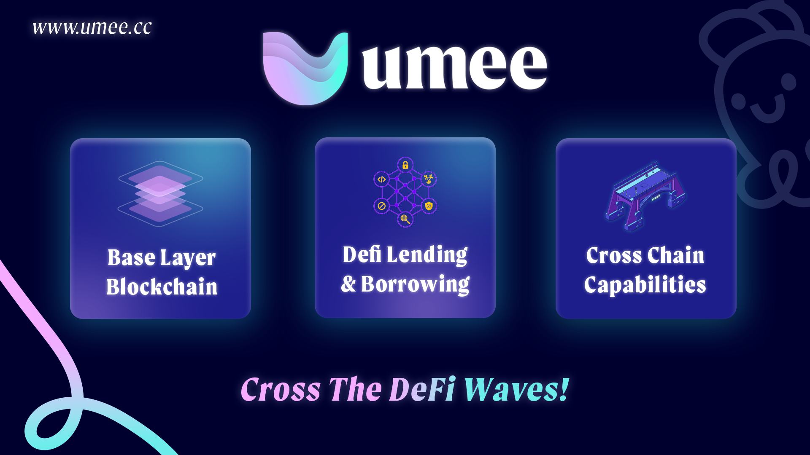

# Overview

## What is Umee?

### Interoperable Base Layer Blockchain

Umee is a base layer blockchain, much like Ethereum. As a base layer blockchain, applications and money lego primitives can be built on top of Umee in order to allow DeFi users to access cross chain leverage and liquidity.

As a Cosmos SDK blockchain, the Umee Network is interoperable with blockchains including Terra, Crypto.com, Binance Chain, Osmosis, Secret Network, and 30+ other chains, plus Ethereum, from Day one.

### Decentralized Lending & Borrowing

Umee allows anyone with an internet connection to supply their crypto assets on the Umee market to easily earn passive lending yield. Umee users can also use their deposits as collateral to borrow other assets and discover new yield opportunities.

Umee is permissionless, and there is no background check or approval needed to use its services.

### Interchain Leverage
Umee will allow users to leverage their favorite assets and access deep liquidity all in one place. Umee is chain and bridge agnostic, and will support the changing needs of users.

## Why Umee?

### Existing Issues
There are three main issues in DeFi right now:

#### Isolated Capital

Capital is siloed across several different networks. Users are unable to move many assets between chains freely. Existing liquidity protocols allow users to lend and borrow assets on the same chain, but not across chains.

#### Concentrated Systematic Risks

DeFi risk is highly concentrated on Ethereum. There is a strong need to diversify this risk while maintaining decentralization on other blockchains.

#### Detached Yields

Proof of Stake and DeFi yields are fundamentally different. Capital does not flow freely based on risk return profiles and thus markets do not operate as efficiently as they should.

### Umee's Vision

Umee aims to be the go-to cross chain DeFi hub to connect various ecosystems together and allow builders to create novel financial products on top. Umee plans to break the inherent silos between blockchains by utilizing bridging solutions towards interconnecting blockchains and encouraging better capital efficiency. The eventual goals will be to enable interchain lending and borrowing, multi-chain staking and delegations, plus cross chain defi rates.

### Advantages

#### Decentralization

The Umee blockchain has a large decentralized validator set. This means that Umee is accessible by anyone with an internet connection regardless of their location or financial status, and users are able to safely transact without the need to trust a centralized entity.

#### Proof of Stake Consensus

Umee is a proof of stake (PoS) blockchain, meaning transactions on Umee are significantly faster and cheaper compared to transactions on proof of work (PoW) blockchains like Bitcoin. PoS blockchains can also be seen as an environmentally friendly option for users because they only consume a small fraction of the energy PoW blockchains do.

Proof of stake assets also may be seen as a viable collateral and credit system for the future.

#### Interoperability

The Umee blockchain is the foundational infrastructure for a wide ecosystem of DeFi protocols. Umee utilizes Cosmos’ Inter-Blockchain Communication Protocol (IBC) to facilitate fast finality transfers of tokens between blockchains. Umee will also utilize various bridging solutions for interconnecting between fast finality and probabilistic finality networks, allowing for even better capital efficiency. In the future, transactions made on the Umee blockchain will be able to natively interact with other blockchains.

#### Infrastructure

Over the long run Umee aims to provide the infrastructure needed for the crypto ecosystem to achieve real world adoption. Umee is both chain and bridge agnostic, making it an ideal blockchain to build lasting products on.

#### User Experience

Existing blockchain technologies are typically overwhelming for new users. The onboarding process alone can be time consuming, and minor mistakes can be costly. DeFi users often must choose between the accessibility of liquidity, transaction costs, transaction speeds, levels of decentralization, overall network security, and more when selecting which blockchain and protocol to interact with.

Umee prioritizes the user experience, and will allow new users to participate in DeFi more easily than ever before. Umee’s technology offers a flexible mix of speed and efficiency for blockchain transactions, without sacrificing decentralization or network security.